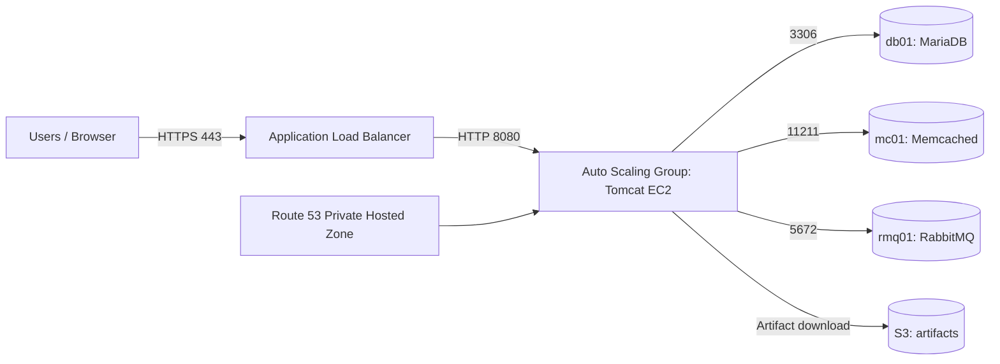

# Lift & Shift vProfile to AWS (EC2 + ALB + ASG + Route 53 Private DNS + S3)

This repo contains **infrastructure scripts, runbooks, and templates** to deploy the classic multi-tier **vProfile** application on AWS using a **Lift & Shift** strategy.

> ⚠️ **Important**: The **vProfile application source code** is not included here.  
> Clone it from the official upstream repository you are using in your course (for example: `hkhcoder/vprofile-project`) and follow the steps in this repo to build the `.war` artifact and deploy it.

---

## What you will build

A production-style AWS setup:

- **EC2 instances**
  - `db01` (MariaDB/MySQL)
  - `mc01` (Memcached)
  - `rmq01` (RabbitMQ)
  - `app01` (Tomcat + vProfile web app)
- **Application Load Balancer (ALB)** with HTTPS (ACM certificate)
- **Auto Scaling Group (ASG)** for the Tomcat layer
- **Route 53 Private Hosted Zone** for internal DNS
- **S3 bucket** to store the application artifact (`.war`)
- **IAM user/keys** (local machine → S3) and **IAM role** (EC2 → S3)

---

## Architecture (high level)

More details: see **docs/DOCUMENTATION.md**

---

## Repository contents

- `userdata/`
  - `mysql.sh` – user data to provision MariaDB + schema
  - `memcache.sh` – user data to provision memcached
  - `rabbitmq.sh` – user data to provision RabbitMQ on Amazon Linux 2023
  - `tomcat_ubuntu.sh` – user data to provision Tomcat 10 on Ubuntu 24.04
- `docs/`
  - `DOCUMENTATION.md` – full documentation, step-by-step
  - `RUNBOOK.md` – operational runbook (verify services, troubleshooting)
  - `SECURITY.md` – security-group rules and IAM guidance
  - `ARCHITECTURE.md` – deeper architecture notes + scaling notes
- `tools/`
  - `build_and_upload.sh` – local helper to build WAR and upload to S3 (optional)
  - `deploy_on_tomcat.sh` – deploy artifact on the Tomcat instance (optional)

---

## Quick start (summary)

1. **Create Key Pair** in EC2 (download `.pem`).
2. **Create Security Groups**:
   - `vprofile-ELB-SG`: allow inbound `80/443` from anywhere.
   - `vprofile-app-sg`: allow inbound `8080` from `vprofile-ELB-SG`, and `22` from your IP.
   - `vprofile-backend-sg`: allow inbound `3306/11211/5672` from `vprofile-app-sg`, and `22` from your IP.
     - Add one more inbound rule: **All traffic from itself** (backend SG) so backend nodes can talk to each other.
3. **Launch EC2 instances** with the scripts under `userdata/`.
4. **Create Route 53 Private Hosted Zone**, e.g. `vprofile.in`, then add A-records:
   - `db01.vprofile.in` → private IP of db01
   - `mc01.vprofile.in` → private IP of mc01
   - `rmq01.vprofile.in` → private IP of rmq01
5. **Build the vProfile WAR locally** and upload to **S3**.
6. On `app01`, **download WAR from S3** and deploy to Tomcat.
7. Create **Target Group (8080)** → Create **ALB** → (Optional) configure **ACM + HTTPS**.
8. Create **AMI → Launch Template → ASG** for the app layer.
9. Enable **stickiness** on the target group (recommended for this app).

---

This project documentation, scripts, and implementation steps were prepared and organized by **Youssef Ahmed**.

Source code used in this project (as followed in the lectures): https://github.com/hkhcoder/vprofile-project

